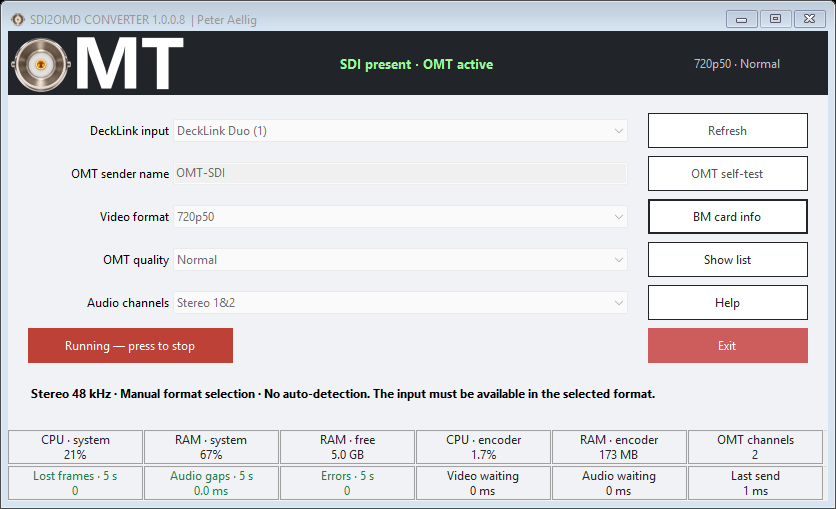
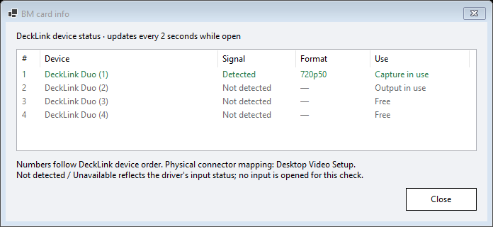

# SDI2OMD CONVERTER

**Live SDI video and embedded audio over your local network, using Open Media Transport.**

A Windows application: select a DeckLink input, choose the matching video format and audio channels, then start transmission.

## Install

1. Install Blackmagic Desktop Video on Windows 10/11 x64.
2. Download the ClickOnce ZIP from [Releases](https://github.com/peteraellig/SDI2OMD-CONVERTER/releases), extract the entire archive and run `setup.exe`.
3. Select the input, video format, OMT quality and audio channels.
4. Click **Start transmission** and select the source in your OMT receiver.

## Features

| Setting | Options |
| --- | --- |
| Video | 720p50, 720p60, 1080p50, 1080p60, 1080i50, 1080i60 |
| Quality | High, Normal, Low |
| Stereo | SDI channels 1&2, 3&4, 5&6, 7&8 |
| Mono | Any channel 1–8, duplicated to left and right |
| Audio output | Stereo, 48 kHz, planar float |

Settings are saved automatically. The main window has a compact fixed size. Labels align left, input fields share a right edge, and action buttons align with the input rows. Current SDI/OMT status is centered in the black header. Two bottom status strips arrange system resources and recent stream health in aligned table cells. The Start/Stop toggle stays on the left; OMT self-test, Show list, Help and Exit are stacked on the right. Show list opens a separate diagnostics window with Close, like BM card info. Closing it disables detailed logging without stopping capture.

**BM card info** opens a separate device-status window with signal detection,
detected input format and capture/output use. It refreshes every two seconds
only while open. **Close** stops all card-status queries. Device numbers follow
SDK enumeration; physical connector mapping is configured in Desktop Video Setup.

**The input must be available in the selected format.** No auto-detection or format conversion.

## License

The project's original code and artwork use the **[BSD Zero Clause License (0BSD)](LICENSE)**. Use, modify and redistribute them, including commercially, without an attribution requirement.

Bundled OMT libraries retain their **MIT license**, including its copyright and license-notice requirement. See [third-party notices](THIRD-PARTY-NOTICES.md) and [the original OMT license](third_party/omt/LICENSE.txt). Blackmagic drivers and Microsoft runtimes retain their own terms.

Windows Forms frontend (C#/.NET 8) with a C++20 DeckLink-to-OMT engine.
Author/publisher: Peter Aellig. Editable Visual Studio form and preserved logo.

## Build and edit

- Double-click SDI-OMT-starten.cmd, or build/Release/SdiOmt.exe.
- Open gui/SdiOmt.sln in Visual Studio. MainForm.cs -> View Designer (Shift+F7).
- Build engine: scripts/build.ps1. Build frontend and copy to release: scripts/build-gui.ps1.
- Installed Blackmagic Desktop Video supplies COM definitions through MSVC #import.
- Visual Studio 2026 C++ tools with ATL, CMake and the .NET 8 SDK are required for development.

## Input and quality

Select the DeckLink input, matching video format, OMT quality and sender name.
Supported manual formats: 720p50, 720p60, 1080p50, 1080p60, 1080i50, 1080i60.
60 means exactly 60 fps, not 59.94. No auto-sense or format conversion.
Capture is 8-bit UYVY. Eight embedded SDI audio channels are captured at 48 kHz. Select Stereo 1&2, 3&4, 5&6 or 7&8, or Mono 1–8. OMT output is always two-channel planar float audio; mono duplicates the chosen channel to both L and R.
OMT qualities: High, Normal (= OMT Medium), Low. Quality is explicitly set;
receivers do not automatically override the selected quality.
Interlaced capture is preserved: 1080i50 = 50 fields / 25 complete frames per second;
1080i60 = 60 fields / 30 complete frames per second. No deinterlacing is applied.
59.94 fps/fields, HDR/10-bit and eight-channel OMT output are not supported.
The DeckLink device is checked for support before opening the selected format.
Physical connector mapping is configured in Blackmagic Desktop Video Setup.
The selected input must be available, not occupied by another application.

Start transmission toggles to Running — press to stop. It stays enabled while
capturing; pressing it again stops the engine. Settings are locked while active.
Live signal, recent losses and CPU/RAM refresh once per second. Detailed logging is disabled while the list is hidden. Help explains the limitations. Exit asks "Are you sure you want to exit?"; confirmation stops any active transmission.
Sender name, device name, video format, quality, audio selection are saved under
%LOCALAPPDATA%/SdiOmt/settings.json. Missing saved devices require reselection.

## Diagnostics

The detailed list window is closed initially. Show list opens or activates it. Its Close button (or window close) disables detailed logging.
Errors reveal the list automatically; the current signal state stays visible.
CPU/RAM, capture/send health and queue state refresh once per second, including when the list is hidden. Detailed per-second log output is enabled only while the separate **Show list** window is open. BM card info remains a separate request and polls only until closed.

Live losses and errors cover the **last five seconds** and expire automatically. The first two seconds of startup (up to the next telemetry sample) are recorded separately. Signal loss and a stalled encoder are shown immediately on the next health update, including during startup. Show list records session and startup totals. “Lost frames” covers replaced/expired queued pictures and gaps detected in SDI timestamps; it does not measure losses in receivers or across the network. “Audio gaps” reports locally discarded audio duration, not a receiver-side measurement.

**Low latency under overload:** one pending video frame, always replaced by the freshest capture; separate audio buffer up to **120 ms**. Older audio is sent first using original timestamps. Queued video older than two frame periods and audio older than 120 ms are discarded. This prevents a growing backlog. An already running OMT encode/send call cannot be interrupted, so total end-to-end latency and uninterrupted audio cannot be guaranteed under sustained CPU starvation. See [queue design and failure behavior](docs/OVERLOAD.md).

No delivery counts zero-byte sends, which can mean no matching receiver or silent audio. Network connections count TCP channels rather than viewers. Worker failures are caught and surfaced to the GUI; serious failures stop capture instead of silently leaving a dead sender. Stop discards pending data and releases DeckLink/OMT. If unresponsive, the frontend terminates only its child engine after five seconds.

## Network

OMT A/V listens on TCP 6400–6600 and discovery uses UDP 5353.
Allow incoming connections on the **sender computer**. Ports are dynamically
selected if other OMT sources are running. Check the active port in the log.
From a receiver, test with `Test-NetConnection <sender-address> -Port <port>`.
Third-party firewalls such as GlassWire may need an additional allow rule.
The optional `scripts/allow-lan.ps1` administrator script permits OMT on the
private local subnet. It is never run automatically.

## ClickOnce

Icon source: logo/SDI.ico, synchronized to gui/Branding/SDI.ico during build.
Branding logo: logo/sdi-omt_logo.png; user-edited form logo is retained separately.
Window title: SDI2OMD CONVERTER 1.0.0.8 | Peter Aellig.

Visual Studio -> Publish -> ClickOnce profile, or scripts/publish-clickonce.cmd.
Build the C++ engine first after engine changes. Export: publish/ClickOnce/setup.exe.
Distribute the entire ClickOnce folder, not just setup.exe.
Version 1.0.0.8 is set in assembly metadata and the deployment manifest.
.NET runtime is included (self-contained x64); setup checks Visual C++ runtime.
Blackmagic Desktop Video must be installed on capture workstations.
Manifests are unsigned; publisher text does not constitute a verified signature.

## Verification

Version 1.0.0.8 adds the bounded video/audio queue and live health displays. Queue/expiry tests, health-window tests and a 25-frame synthetic loopback passed. Live 720p50 capture passed six GUI-driven starts / five reconnects and 30 seconds each at Normal, High and Low with a changing test-picture source. Received timestamps had no video/audio gaps; one internal queued picture was discarded at Normal. The source supplied silent audio; audible sound under CPU saturation remains unverified.

Version 1.0.0.5 adds interlaced capture and passed 18 sender starts with one
persistent receiver, including High/Low quality changes. See [test details](docs/TESTING.md).
Live 720p50 SDI video/audio also passed six GUI-driven starts and five reconnects
with one persistent receiver. Physical interlaced SDI video and remote/vMix
reconnection remain unverified.

- A fresh source checkout built successfully with MSVC and .NET 8. Windows Forms
  built without warnings; MSVC reports a standard DeckLink COM type-import warning.
- Original 12 progressive OMT loopbacks: all four progressive formats with High/Normal/Low, each 80 video frames
  and 80 stereo audio packets; received dimensions, fps and audio format checked.
- GUI: device detection, format/quality/audio options, title/version, hidden/show
  list, selftest, start/stop toggle and right-side layout at two window sizes verified.
- Actual DeckLink capture/start/stop tested with 720p50. Other input signal formats
  require corresponding physical SDI sources for end-to-end hardware verification.
- ClickOnce export created with native engine, OMT libraries, runtime and icon.

OMT binaries: v1.0.0.19 from [openmediatransport/libomtnet](https://github.com/openmediatransport/libomtnet).
MIT license is included as OMT-LICENSE.txt in the application package.

All twelve audio selections passed OMT loopback with 60 video frames and 60 audio packets each. Every received sample was checked against a distinct test value for its source channel; mono L/R matched exactly. Physical distinct signals on SDI channels 3–8 still require a corresponding source for end-to-end verification.

